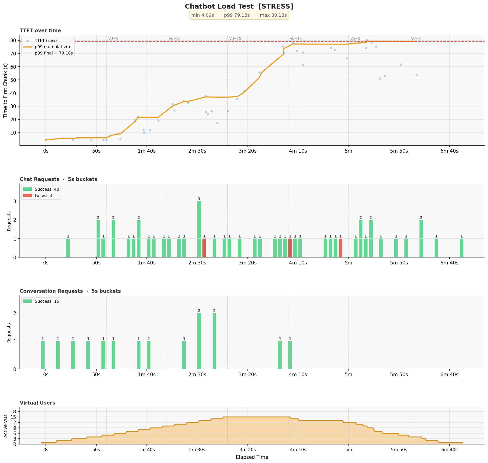

# CloudCIX Load Testing

A k6-based load testing suite for benchmarking SSE streaming APIs. Includes two test scripts:

1. **Chatbot Test** (`scripts/chatbot/`) — benchmarks the CloudCIX chatbot API (conversation + SSE answer streaming)
2. **OpenAI Test** (`scripts/openai/`) — benchmarks any OpenAI-compatible `/chat/completions` endpoint (vLLM, llama.cpp, Ollama, etc.)

Both tests measure Time to First Token (TTFT) and chunk inter-arrival time under various load profiles, and share the same presets, questions, and results infrastructure.

---

## Requirements

- [k6](https://k6.io/docs/getting-started/installation/) with the [xk6-sse](https://github.com/phymbert/xk6-sse) extension
- Python 3 (`make venv` will install `pandas` and `matplotlib` automatically)

```bash
make venv
```

---

## Folder Structure

The project is structured around **Separation of Concerns and Reusability**:

1. **Isolated Test Scripts**: Each API target (chatbot, openai) gets its own dedicated folder under `scripts/`. This keeps target-specific logic—the k6 test and the Python plot script—tightly coupled to each other but completely isolated from other API targets.
2. **Shared Testing Assets**: Data assets that define the tests (like load `presets/`, `questions/`, and configurations `envs/`) are kept at the root. This guarantees that when comparing different APIs, they are subjected to the exact same load profiles and questions. 
3. **Zero-Boilerplate Extensibility**: Adding a new test target only involves creating a new folder with `test.js` and `plot.py`, instantly hooking into the existing Makefile, presets, and questions system.

```
├── scripts/
│   ├── chatbot/
│   │   ├── test.js           # CloudCIX chatbot test (SSE via xk6-sse)
│   │   └── plot.py           # 4-panel plot (TTFT, chat, conv, VUs + correlation)
│   └── openai/
│       ├── test.js           # OpenAI /chat/completions test
│       └── plot.py           # 2-panel plot (TTFT + VUs)
├── Makefile                  # Orchestrates benchmark and plot
├── .env                      # Symlink to active env file (git ignored)
├── .gitignore
├── envs/                     # Environment configurations
│   ├── example.env           # Chatbot test template
│   ├── openai_example.env    # OpenAI test template
│   └── *.env                 # Your env files (git ignored)
├── presets/                  # Load profile definitions (shared by all tests)
│   ├── smoke.json            # 1 VU, sanity check
│   ├── breaking.json         # Ramp up until the server breaks (default)
│   ├── soak.json             # Sustained load to detect degradation over time
│   ├── spike.json            # Sudden burst then back to normal
│   └── stress.json           # Gradual increase beyond expected capacity
├── questions/                # Question datasets (shared by all tests)
│   ├── cloudcix.json         # Broader CloudCIX question set
│   └── sharegpt.json         # Real-world general questions from ShareGPT
└── results/                  # All benchmark results (git ignored, auto-created)
    └── {timestamp}_{preset}/
        ├── results.json      # Raw k6 output
        ├── ttft_{preset}.png # TTFT plot
        └── summary.txt       # Full terminal output
```

### Adding a New Test

To add a new test type, create a new folder under `scripts/` with `test.js` and `plot.py`:

```bash
mkdir scripts/my_test
# Add scripts/my_test/test.js and scripts/my_test/plot.py
make run SCRIPT=my_test PRESET=smoke QUESTIONS_FILE=cloudcix
```

No changes needed to the `Makefile`.

---

## Getting Started

### Chatbot Test

```bash
# 1. Copy the example env and fill in your credentials
cp envs/example.env envs/production.env
vim envs/production.env

# 2. Switch to your environment
make env ENV=production

# 3. Setup Python virtual environment for plotting (only needed once)
make venv

# 4. Run a smoke test to verify everything works
make smoke

# 5. Run a full breaking point test
make breaking
```

### OpenAI Test

```bash
# 1. Copy the template and fill in your server details
cp envs/openai_example.env envs/my_server.env
vim envs/my_server.env

# 2. Switch to your environment
make env ENV=my_server

# 3. Setup Python virtual environment for plotting (only needed once)
make venv

# 4. Run a smoke test
make run SCRIPT=openai PRESET=smoke QUESTIONS_FILE=cloudcix

# 5. Run a full breaking point test
make run SCRIPT=openai PRESET=breaking QUESTIONS_FILE=sharegpt
```

---

## Switching Environments

Each environment has its own file in `envs/`. The active environment is a symlink at `.env`.

```bash
# Switch to staging
make env ENV=staging

# Switch to production
make env ENV=production

# See which environment is active
make env-show
```

---

## How to Run

The `SCRIPT` variable selects which test to run. It defaults to `chatbot`.

```bash
# Chatbot test (default)
make run
make run SCRIPT=chatbot

# OpenAI test
make run SCRIPT=openai

# With preset and questions
make run SCRIPT=openai PRESET=stress QUESTIONS_FILE=sharegpt

# Preset shortcuts (use default SCRIPT)
make smoke
make breaking
make soak
make spike
make stress

# List all past runs
make list

# Replot an existing run
python3 scripts/chatbot/plot.py results/2026-03-03_14-22-01_breaking/results.json breaking
python3 scripts/openai/plot.py results/2026-03-05_16-03-59_smoke/results.json smoke

# Clean all results
make clean
```

---

## Presets

A preset defines the load profile for a test run — it controls how many virtual users (VUs) are active and for how long. Each preset is a JSON file in the `presets/` folder containing a list of stages. Each stage has a `duration` and a `target` VU count. k6 linearly ramps the VU count from the previous stage's target to the current stage's target over the given duration.

For example, this preset ramps from 0 to 50 VUs over 5 minutes, holds for 1 hour, then ramps back down:

```json
[
    { "duration": "5m",  "target": 50 },
    { "duration": "1h",  "target": 50 },
    { "duration": "5m",  "target": 0  }
]
```

You select a preset at runtime via the `PRESET` variable. The test script reads the corresponding file from `presets/<PRESET>.json` automatically — no code changes needed.

### Built-in Presets

| Preset | Purpose | Shape |
|---|---|---|
| `smoke` | Sanity check — verifies the test and API are working | 1 VU for 30s |
| `breaking` | Finds the point where the server starts failing | Ramp 10→100 VUs, no soak |
| `soak` | Detects memory leaks and gradual performance degradation | Ramp up to 50 VUs, hold for 8h, ramp down |
| `spike` | Tests recovery from a sudden burst of traffic | Jump to 100 VUs, drop back to normal |
| `stress` | Measures how performance degrades as load grows | Slow ramp to 100 VUs |

### Adding a New Preset

1. Create a new file in the `presets/` folder:

```bash
touch presets/my_preset.json
```

2. Define your stages:

```json
[
    { "duration": "30s", "target": 10 },
    { "duration": "1m",  "target": 50 },
    { "duration": "1m",  "target": 50 },
    { "duration": "30s", "target": 0  }
]
```

3. Run it:

```bash
make run PRESET=my_preset
```

No changes needed to test scripts, plot scripts, or the `Makefile`.

---

## Adding a New Environment

1. Create a new env file in `envs/`:

```bash
cp envs/example.env envs/my_env.env
vim envs/my_env.env
```

2. Switch to it:

```bash
make env ENV=my_env
```

---

## Custom Question Datasets

By default, the test uses a built-in pool of 40 questions covering general CloudCIX topics. Each VU picks a question at random from the pool on every iteration.

To use your own questions, create a JSON file containing a flat array of strings:

```json
[
    "How does billing work in CloudCIX?",
    "What payment methods are accepted?",
    "How do I view my invoice?",
    "Can I get a refund?"
]
```

Then pass it in at runtime:

```bash
make run PRESET=soak QUESTIONS_FILE=my_questions
```

The test will log how many questions were loaded at startup so you can confirm it picked up the right file.

### OpenAI: Use Llama/Mistral Tokenizers (Hugging Face)

If you need exact token counts using model tokenizers (for example Llama 3 or Mistral Large 3), generate a dataset file first with the helper script, then run the OpenAI test with `QUESTIONS_FILE`.

1. Install tokenizer dependencies:

```bash
pip install -r requirements-hf.txt
```

2. Generate a dataset with exact token counts using the model tokenizer:

```bash
python3 scripts/openai/generate_questions_hf.py \
    --model-id mistralai/Mistral-Large-3-675B-Instruct-2512 \
    --fix-mistral-regex \
    --output-file questions/mistral_large3_256t.json \
    --dataset-size 200 \
    --tokens-per-prompt 256 \
    --seed 1337
```

3. Run the benchmark against that dataset:

```bash
make run SCRIPT=openai PRESET=smoke QUESTIONS_FILE=mistral_large3_256t
```

4. Inspect token length per entry in any questions file:

```bash
python3 scripts/openai/token_lengths.py \
    --questions-file questions/mistral_large3_256t.json \
    --tokenizer hf \
    --model-id mistralai/Mistral-Large-3-675B-Instruct-2512 \
    --fix-mistral-regex
```

You can swap `--model-id` for any Hugging Face tokenizer id, such as a Llama 3 tokenizer.
The generator auto-enables `fix_mistral_regex` for `mistralai/*` model ids (or you can pass `--fix-mistral-regex` explicitly).

### Included Datasets

#### `questions/cloudcix.json` — CloudCIX Domain Questions

A curated set of questions specifically about CloudCIX — virtual machines, networking, storage, billing, security, and the API. Best used when you want to stress test the chatbot on its intended domain and measure how it handles topic-specific load.


#### `questions/sharegpt.json` — Real-World General Questions (ShareGPT)

A dataset of real opening questions extracted from the [ShareGPT52K](https://huggingface.co/datasets/RyokoAI/ShareGPT52K) dataset — 52K real human-AI conversations collected from ChatGPT users and released under CC0. Using this dataset simulates realistic, unpredictable day-to-day usage rather than a narrow topic pool, which is ideal for soak and stress testing.

---

## Metrics

### Chatbot Test Metrics

| Metric | Description |
|---|---|
| `ttft_ms` | Time from request start to first chunk received (ms) |
| `chunk_inter_arrival_ms` | Time between consecutive chunks (ms) |
| `chat_total` | Total chat requests attempted |
| `chat_success` | Chat requests that completed successfully |
| `chat_failed` | Chat requests that failed (non-200, timeout, or no chunks) |
| `conv_total` | Total conversation creation attempts |
| `conv_success` | Successful conversation creations |
| `conv_failed` | Failed conversation creations |

### OpenAI Test Metrics

| Metric | Description |
|---|---|
| `ttft_ms` | Time from request start to first content token (ms) |
| `chunk_inter_arrival_ms` | Time between consecutive content chunks (ms) |
| `tokens_per_request` | Number of content chunks (≈ tokens) per request |
| `total_duration_ms` | Total request duration including streaming (ms) |
| `chat_total` | Total chat requests attempted |
| `chat_success` | Chat requests that completed with content |
| `chat_failed` | Chat requests that failed |

---

## Understanding the Plots

### Chatbot Plot (4-panel)

Each chatbot run produces a four-panel plot saved to `results/{timestamp}_{preset}/ttft_{preset}.png`.

Example output:


- **Panel 1 — TTFT over time** — scatter of raw time-to-first-chunk values (dots) overlaid with a cumulative p99 trend line and a final p99 reference line. A rising p99 line indicates the server is slowing down under load. The title bar shows `min`, `p99`, and `max` across the full run.
- **Panel 2 — Chat Requests** — bar chart bucketed by time window (5s for short runs, 120s for soak runs) showing successful (green) and failed (red) chat requests. Each bar is labelled with its count. Useful for pinpointing exactly when failures started relative to load.
- **Panel 3 — Conversation Requests** — same bar chart layout as Panel 2 but for conversation creation events. Since conversations are created once per VU, bars are sparse and concentrated during the ramp-up phase.
- **Panel 4 — Virtual Users** — filled area chart showing active VU count over time, with a peak annotation marking the highest concurrency reached during the run.

Vertical dashed lines mark stage boundaries across all panels so you can correlate TTFT degradation and failure spikes with the exact moment VU count changed. Stage labels (`VU=N`) appear at the top of Panel 1.

### OpenAI Plot (2-panel)

Each OpenAI run produces a two-panel plot:

- **Panel 1 — TTFT over time** — same as chatbot plot: scatter, cumulative p99 trend, and final p99 line.
- **Panel 2 — Virtual Users** — active VU count over time with peak annotation.

---

## Environment Variables

All variables are set via the active `.env` file. Use `make env ENV=<name>` to switch.

### Chatbot Test

| Variable | Default | Description |
|---|---|---|
| `CLOUDCIX_API_BASE` | `api.cloudcix.com` | Base API domain |
| `CLOUDCIX_API_USERNAME` | — | Auth email |
| `CLOUDCIX_API_PASSWORD` | — | Auth password |
| `CLOUDCIX_API_KEY` | — | API key |
| `CHATBOT_NAME` | `Guiden` | Name of the chatbot to test |
| `FIRST_CHUNK_TIMEOUT_MS` | `300000` | Max time to wait for first chunk (ms) |
| `PRESET` | `breaking` | Load profile preset to use |
| `QUESTIONS_FILE` | _(unset)_ | Questions dataset name (e.g. `cloudcix`, `sharegpt`) |

### OpenAI Test

| Variable | Default | Description |
|---|---|---|
| `OPENAI_BASE_URL` | — | Server base URL (e.g. `http://localhost:8000/v1`) |
| `OPENAI_API_KEY` | — | API key / Bearer token |
| `OPENAI_MODEL` | — | Model name to request |
| `OPENAI_TEMPERATURE` | `0` | Sampling temperature; keep `0` for least variability |
| `OPENAI_TOP_P` | `1` | Nucleus sampling parameter; keep `1` for deterministic-style sampling with `temperature=0` |
| `OPENAI_SEED` | _(unset)_ | Optional fixed seed for reproducible outputs (backend must support `seed`) |
| `OPENAI_SLEEP_MIN` | `0.5` | Minimum sleep time (seconds) between VU iterations; set both to `0` to skip sleep entirely |
| `OPENAI_SLEEP_MAX` | `2.5` | Maximum sleep time (seconds) between VU iterations; set both to `0` to skip sleep entirely |
| `FIRST_CHUNK_TIMEOUT_MS` | `300000` | Max time to wait for first chunk (ms) |
| `PRESET` | `breaking` | Load profile preset |
| `QUESTIONS_FILE` | _(unset)_ | Questions dataset name (e.g. `cloudcix`, `sharegpt`) |